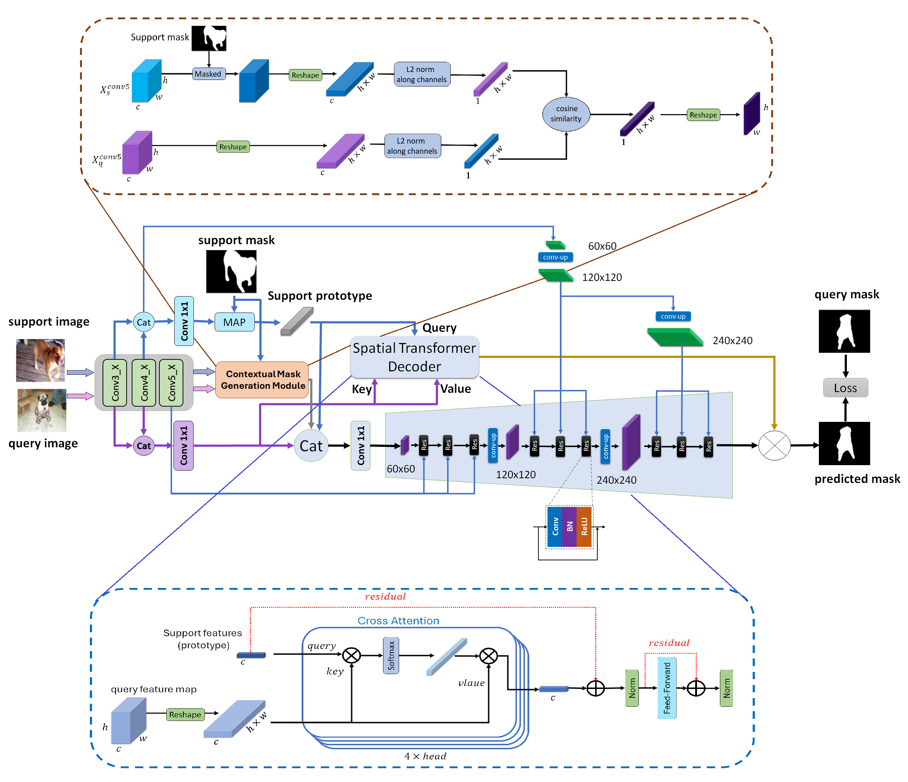

## MSDNet: Multi-Scale Decoder for Few-Shot Semantic Segmentation via Transformer-Guided Prototyping
This is the implementation of the paper "MSDNet: Multi-Scale Decoder for Few-Shot Semantic Segmentation via Transformer-Guided Prototyping" by Fateh Amirreza, Mohammadi Mohammadreza, Jahed-Motlagh Mohammadreza.

For more information, check out our paper on [[arXiv](https://arxiv.org/abs/2409.11316)], [[paperswithcode](https://paperswithcode.com/paper/msdnet-multi-scale-decoder-for-few-shot)].

<p align="middle">
    
</p>


Conda environment settings:
```bash
conda create -n msd python=3.8
conda activate msd

pip install -r requirements.txt
```

## Run demo

> ### 1. PASCAL-5<sup>i</sup>
> ```bash
> python app.py
> ```


## Acknowledgements
This project is implement from MSDNet: https://github.com/amirrezafateh/msdnet
## Citation
If you use this repository in your work, please cite the following paper:
```bibtex
@article{fateh2024msdnet,
  title={MSDNet: Multi-Scale Decoder for Few-Shot Semantic Segmentation via Transformer-Guided Prototyping},
  author={Fateh, Amirreza and Mohammadi, Mohammad Reza and Motlagh, Mohammad Reza Jahed},
  journal={arXiv preprint arXiv:2409.11316},
  year={2024}
}
# msdnet
# msdnet
# msdnet
